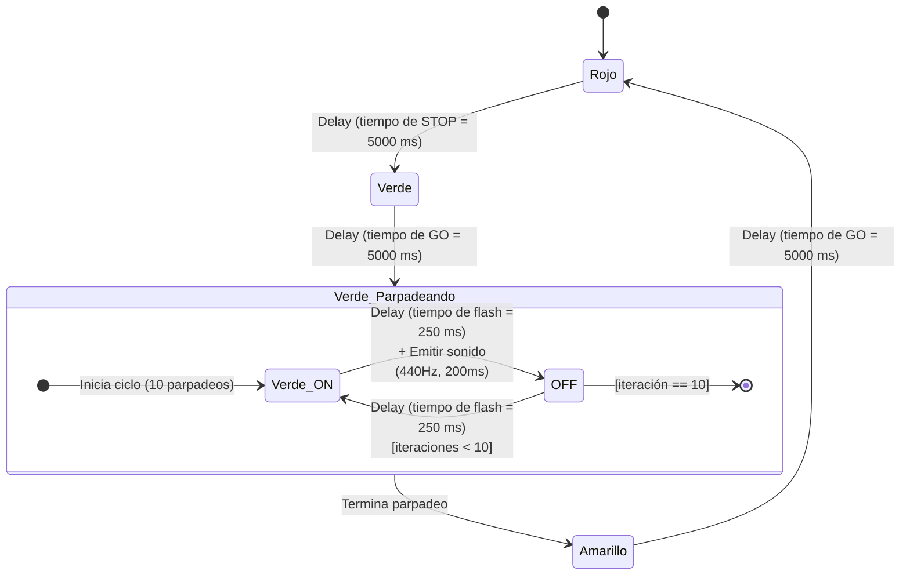

# lab-1-circuit-playground-classic

La finalidad de este laboratorio es familiarizarse con el **IDE de Arduino** para la programación y el uso de la plataforma de desarrollo **Circuit Playground Classic**.

## Laboratorio #1 - Sistemas Empotrados de Tiempo Real

### Introducción a Circuit Playground Classic

**Integrantes:** 
- Isabella Rodríguez Sánchez (C26701)
- Esteban Isaac Baires Cerdas (C10844)
- Jorge Ricardo Díaz Sagot (C12565)

**Objetivos del laboratorio:**
1. Conocimiento sobre la plataforma de desarrollo utilizada.
2. Programación de las luces según los enlaces brindados.
3. Conocimiento sobre el semáforo de control basado en tiempo fijo.
4. Diseño e implementación del semáforo de control basado en tiempo fijo.

---

### OBJ 1: Arduino IDE

Se descargó Arduino IDE y se dieron los permisos necesarios. Luego de conectar el Circuit Playground se descargaron las dependencias y la librería necesaria.

Esto para el sistema operativo Windowns 11. El cual requiere permisos de administrador para la instalación de drivers extra.

Sobre el IDE, tiene las siguientes funcionalidades [1] en su cliente de escritorio:

> **Verify / Upload:** compile and upload your code to your Arduino Board.
>
> **Select Board & Port:** detected Arduino boards automatically show up here, along with the port number.
>
> **Sketchbook:** here you will find all of your sketches locally stored on your computer. Additionally, you can sync with the Arduino Cloud, and also obtain your sketches from the online environment.
>
> **Boards Manager:** browse through Arduino & third party packages that can be installed. For example, using a MKR WiFi 1010 board requires the Arduino SAMD Boards package installed.
>
> **Library Manager:** browse through thousands of Arduino libraries, made by Arduino & its community.
>
> **Debugger:** test and debug programs in real time.
> **Search:** search for keywords in your code.
> **Open Serial Monitor:** opens the Serial Monitor tool, as a new tab in the console.

---

### OBJ 3: Semáforo de tiempo fijo

Este tipo de semáforo es de los más sencillos. Funciona con ciclos de colores en tiempos configurados previamente. 

Por ejemplo, está en rojo por 5 minutos antes de cambiar a verde por otros 5 minutos.

**Características**:
- Este tipo de semáforo no depende de sensores o inputs de ningún tipo. 
- Se puede aplicar para semáforos de tránsito y peatonales. En este caso, al añadir sonido antes de pasar a verde, sería más útil para los peatones.

> **En Semáforos de tiempo fijo:** Los semáforos de tiempo fijo se utilizan en aquellas intersecciones donde el comportamiento de tránsito es estable, es decir donde los flujos vehiculares se pueden adaptar a un programa de tiempos previsto, sin ocasionar demoras o congestionamiento excesivo. Los semáforos de tiempo fijo, se adaptan fácilmente a aquellas ocasiones en que queremos coordinar varias intersecciones a lo largo de un corredor vehicular [4].

---

### OBJ 4: Diseño e implementación del semáforo de control basado en tiempo fijo

**Pseudocódigo del semáforo:**
```text
INICIO:
  Configurar variables globales: colores, brillo, tiempo de STOP, tiempo de GO, tiempo de flash(sonido y parpadeo) y preparar placa.

CICLO PRINCIPAL:
  PASO 1 (ROJO):
    Encender todos los LEDs en rojo
    Delay (tiempo de STOP: 5000 ms)

  PASO 2 (VERDE):
    Encender todos los LEDs en verde
    Delay (tiempo de GO: 5000 ms)

  PASO 3 (VERDE PARPADEANDO):
    Repetir 10 veces: (10 parpadeos)
      Encender todos los LEDs en verde
      Delay (tiempo de flash: 250 ms)
      Emitir sonido (440Hz, 200ms)
      Apagar todos los LEDs
      Delay (tiempo de flash: 250 ms)

  PASO 4 (AMARILLO):
    Encender todos los LEDs en amarillo
    Delay (tiempo de GO: 5000 ms)
```



---

### OBJ 2: Programación de luces según las guías

Se probaron diferentes animaciones que venían en las guías [2], [3], configurando los tiempos, colores y brillo. Se decidió incorporar luces flasheando antes de que el semáforo cambie de verde a amarillo.

**Código de semáforo de tiempo fijo:**

Código: [semaforo-control-basado-tiempo-fijo.ino](./code/semaforo-control-basado-tiempo-fijo.ino).

**Circuit Playground Classic funcionando:**

Descargar video completo: [circuit-playground-classic-funcionando.mp4](./media/circuit-playground-classic-funcionando.mp4).


---

## Referencias

> **Aclaración sobre el uso de la Inteligencia Artificial:**
> Para la estructuración, corrección de estilo y formato Markdown de este documento, se utilizó como asistencia un asistente de desarrollo con Inteligencia Artificial.

[1] Arduino, "Getting Started with Arduino IDE 2," Arduino Documentation. [Online]. Available: https://docs.arduino.cc/software/ide-v2/tutorials/getting-started-ide-v2/.

[2] Adafruit, "Introducing Circuit Playground," Adafruit Learning System. [Online]. Available: https://learn.adafruit.com/introducing-circuit-playground/overview.

[3] Adafruit, "Circuit Playground Bike Light," Adafruit Learning System. [Online]. Available: https://learn.adafruit.com/circuit-playground-bike-light/overview.

[4] Ministerio de Obras Públicas y Transportes (MOPT), "Semáforos". [Online]. Available: https://repositorio.mopt.go.cr/server/api/core/bitstreams/90d07687-b340-4304-945b-acb89ec9cf78/content.
